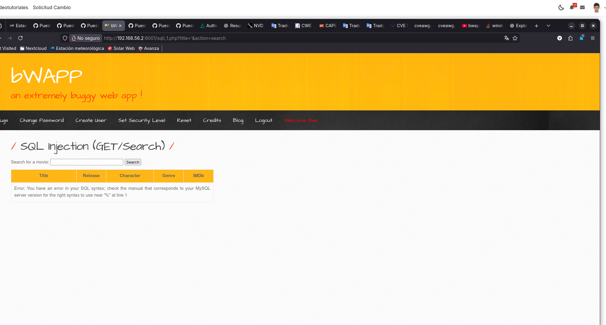
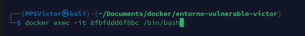
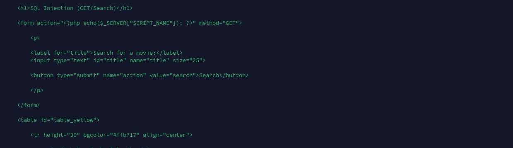
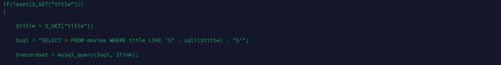
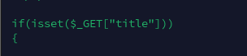
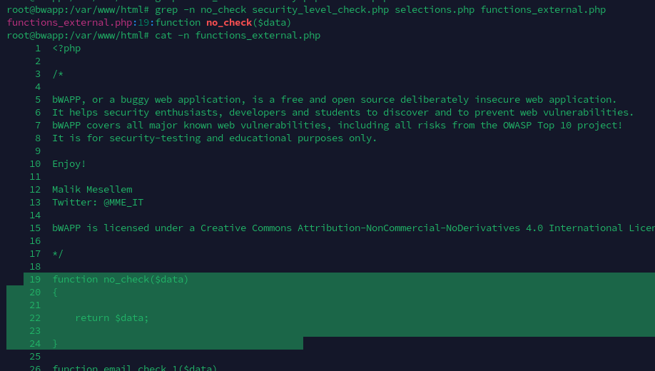

# Apartado 2 - Análisis de vulnerabilidad

En este apartado, se analiza la vulnerabilidad **“SQL Injection (GET/SEARCH)”** de el entorno “bWAPP”. Concretamente, se centra en el análisis del código que permite esta vulnerabilidad se explotada por los atacantes. El despliegue de este entorno se realiza en una máquina virtual de Kali linux dentro de Docker.

---

### **Identificación del endpoint vulnerable**

En la siguiente captura, podemos observar que hay un campo al cual podemos buscar diferentes nombres de películas. 


Para comprobar la vulnerabilidad, introduciremos un carácter usado en las consultas de SQL para ver si nos da algún error.



Concretamente nos da un error de sintaxis de SQL, por lo que significa que el carácter puesto esta realizando una función dentro de backend (concretamente cerrando una parte de la consulta cuando no debería).

---

## Explotación de la vulnerabilidad

Con la información anterior, podemos inyectar código sql a través del mismo input del html. Además, para que resulte algo más sencillo las pruebas, en la misma url podríamos meter todo nuestro código malicioso. 

En este caso, muestro una simple inyección de sql que me permite listar todo el contenido esa tabla y ordenarlo por la columna del año.


---

## Análisis del código vulnerable

Si queremos acceder al código que contiene la vulnerabilidad de “Inyección de SQL”, tendremos que realizar los siguientes pasos: 

### 1.0 Identificar el contenedor

Una vez que tenemos nuestro entorno ejecutándose, debemos listar los contenedores activos:

```python
docker ps
```


Tras haber listado los contenedores, tenemos que identificar cual es. Para ello, buscar ver por el nombre de la imagen, la cual encontramos una llamada **bwapp.**


### 2.0 Acceder a la terminal de este

Para acceder a la terminal de este contenedor, **debemos copiar el ID del contenedor de bwapp** y ejecutar el siguiente comando:

```python
docker exec -it ID_CONTENEDOR /bin/bash
```



### 3.0 Análisis del código

El primer código que analizaremos será: **/var/www/html/sqli_1.php**



En la imagen anterior, podemos ver que el propio html identifica el texto que nosotros añadimos por el input como “tittle”.



Concretamente, podemos ver como se procesa esa variable que lleva nuestro código, por lo que podemos identificar que realiza varias validaciones:

- Comprueba que **tittle** no este vacía



- Justo antes de llamar a la consulta, **tittle** pasa por la función .sqli

```python
$sql = "SELECT * FROM movies WHERE title LIKE '%" . sqli($title) . "%'";
```

- Esta función esta definida al principio del archivo y es la encargada de establecer el tipo procesador que se le dará a nuestra variable dependiendo del nivel de seguridad.


- En esta podemos ver que en función de nuestro nivel de seguridad, tendremos un tipo de filtro. Al ser un nivel de seguridad de bajo, en este caso es 0 y nuestro **tittle,** es enviado a la función **no_check (la cual no realiza ninguna validación)**.



Entonces, podemos determinar que al no realizarse ninguna validación, el código que introduzcamos por el input, será procesado por el archivo de php analizado.

---

## Conclusión

Toda esta información la podemos usar para realizar consultas a la base de datos perniciosas siempre y cuando nuestro nivel de seguridad sea bajo. Todo esto pueden llegar a vulnerar la máquina y comprometer la seguridad de la misma.
