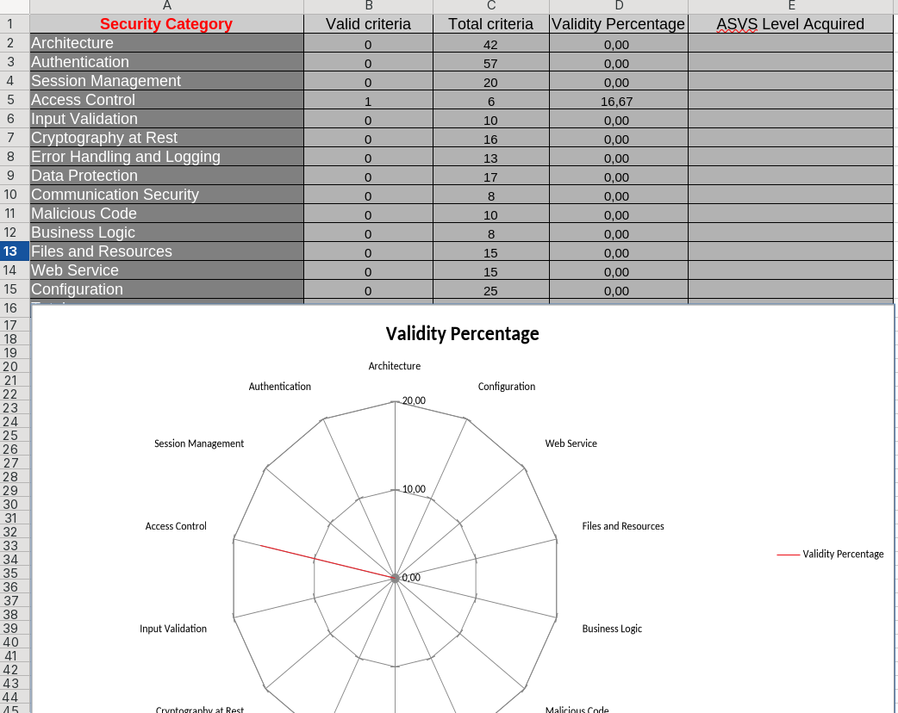

# Apartado 3 - Comprobación de los requisitos de Seguridad de una aplicación.

En este apartado consisten en analizar la aplicación desarrollada previamente en Python (Tarea1) desde el punto de vista de la seguridad. 

Para ello se utiliza el estándar OWASP ASVS como marco de verificación de requisitos.  En este se elaborarán una checklist donde se evaluarán controles relacionados el código malicioso.

Finalmente, se reflexionará sobre el grado de cobertura obtenido y la utilidad del modelo ASVS en aplicaciones reales.

---

## Nivel de seguridad requerido

Para establecer que nivel de protección adecuado, tenemos que analizar concretamente el uso al que va ha estar expuesto nuestro programa.

Este programa es el encargado de realizar un lavado de los coches (un lavadero), por lo que se encarga de cobrar a los clientes y iniciar el lavado pasando por diferentes fases. 

Entonces, para evaluar el nivel de seguridad requerido, nos basaremos en “Finalmente, se reflexionará sobre el grado de cobertura obtenido y la utilidad del modelo ASVS en aplicaciones **“La metodología de evaluación de OWASP**”:

- Probabilidad del riesgo: **BAJA**
- Tipo de riesgo: caída del lavadero o el pago incorrecto del lavado.
- Impacto técnico: Mínimo (Posible caída del lavadero)
- Impacto en el negocio: Mínimo (Daño económico mínimo)

Con esta breve información, podemos identificar que el entorno en el que se ejecutará el programa y su uso, no tiene capacidad de realizar un ataque que afecte gravemente a la empresa, ya que este tipo de programas se suelen utilizar en un entorno totalmente aislado (sin conexión a internet) y que no repercuten ningún tipo de amenaza para otro activo de la empresa que no sea el propio lavadero. Por ello, una conclusión razonable es que el **nivel de seguridad requerido sea de 1 (El mas bajo),** ya que realmente es un software genérico**.**

---

## Análisis del gráfico de la hoja de cálculos

El gráfico generado a partir de la hoja de cálculo muestra un nivel de cumplimiento extremadamente bajo de los requisitos del estándar OWASP ASVS. De un total de 16 criterios evaluados, únicamente se cumple, indicando que la aplicación carece prácticamente de controles de seguridad implementados.

El único apartado con algún grado de cumplimiento es **Control de Acceso**, con 1 de 6 criterios validados (16,67 %), mientras que la otra categoría presentan un 0 %. Esto evidencia que la aplicación fue desarrollada con un enfoque puramente funcional, sin integrar medidas de seguridad desde la arquitectura ni durante el desarrollo.

---

## Herramientas automáticas para la comprobación de “General Access Control Design”

Aunque muchos controles de diseño de acceso requieren revisión manual, existen herramientas automáticas que ayudan a detectar fallos relacionados con la autorización y la protección de recursos:

### 1. OWASP ZAP

Permite identificar:

- Accesos a endpoints sin autenticación
- Manipulación de parámetros para probar IDOR
- Fallos en restricciones de rutas protegidas
- Bypass de controles del lado cliente

Muy útil para comprobar si el backend realmente valida permisos.

---

### 2. Burp Suite

Facilita pruebas automáticas de:

- Forzado de navegación a recursos restringidos
- Modificación de roles y parámetros sensibles
- Acceso horizontal entre usuarios
- Detección de endpoints administrativos expuestos

Incluye módulos de fuzzing y testing de autorización.

---

## Conclusión

El análisis realizado demuestra que, aunque la aplicación del lavadero presenta un riesgo bajo y solo requiere un nivel ASVS 1, su grado actual de cumplimiento en seguridad es prácticamente inexistente. La verificación evidencia que el desarrollo se centró únicamente en la funcionalidad, dejando sin implementar controles básicos recomendados por OWASP.
