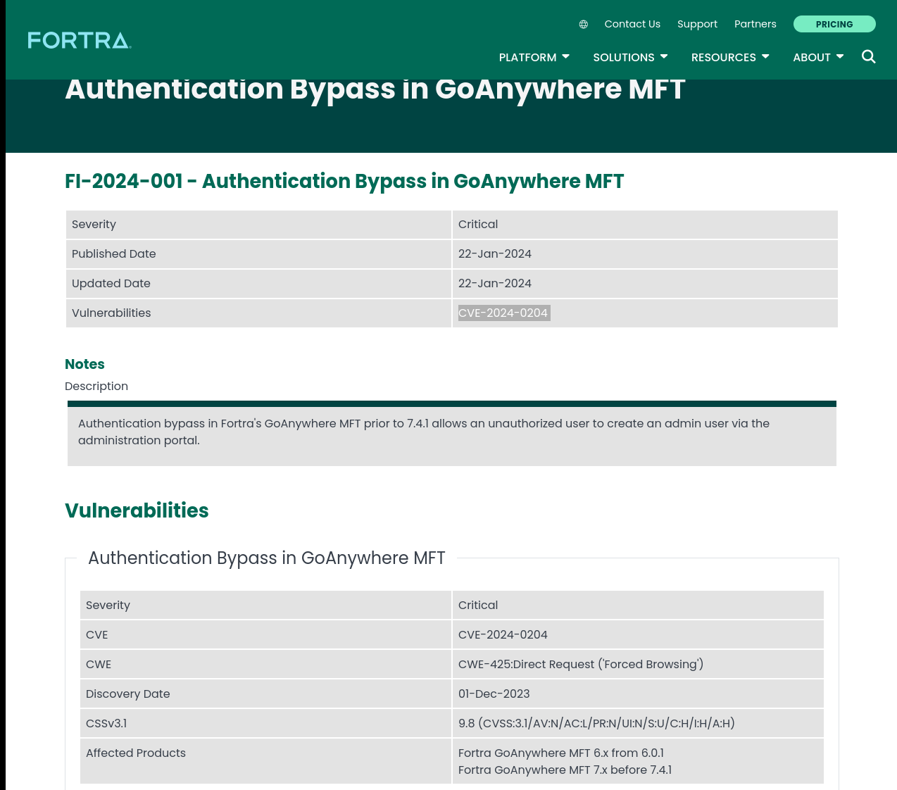
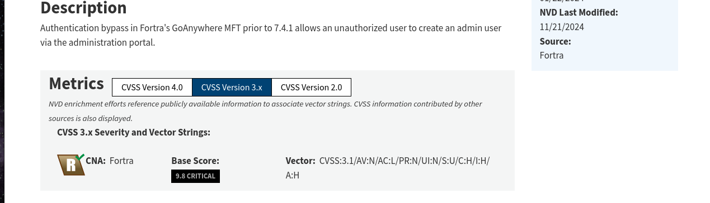
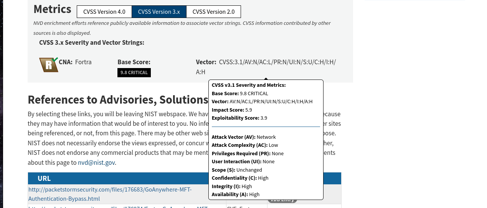
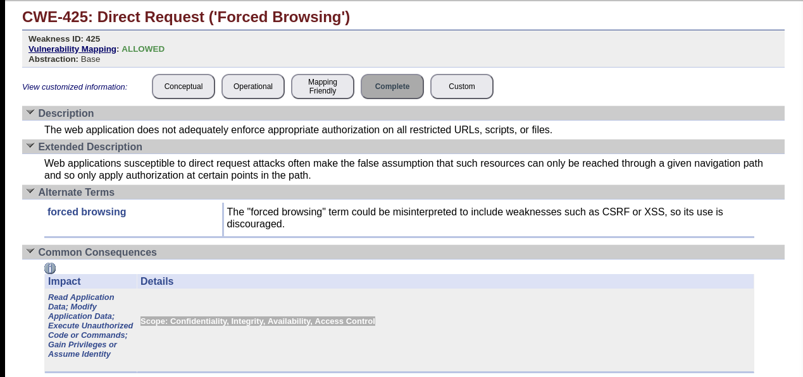
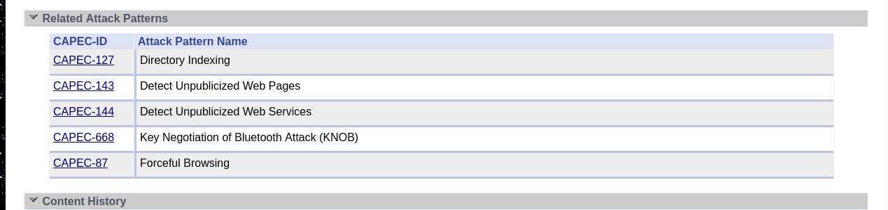
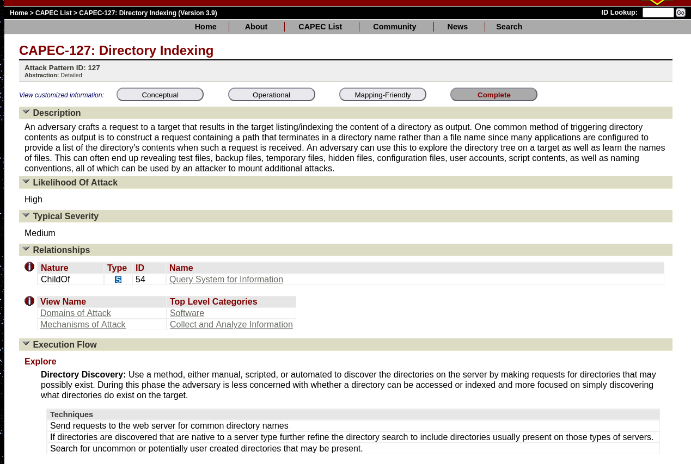
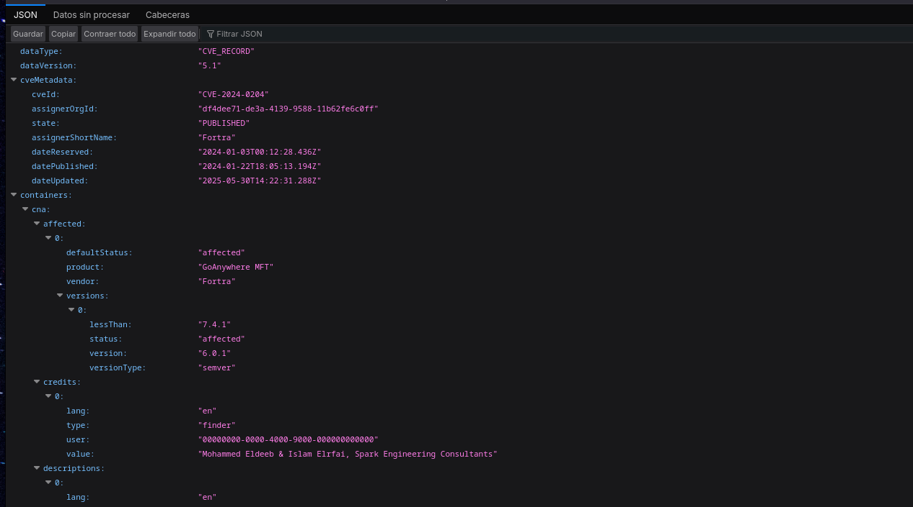

# Apartado 1 - Trazado de la vulnerabiliad.

---

Durante esta sección, se detallan diferentes aspectos sobre la **vulnerabilidad crítica de omisión de autenticación en GoAnywhere MFT de Fortra.** El objetivo es identificar claramente el trazado, la información acerca de esta, el riesgo, criticidad y sus posibles debilidades que puedan ser explotadas.

---

## Indice:

- Fuentes y trazas de la vulnerabilidad
- Vulnerabilidades encontradas
- Riesgo y criticidad de “**CVE-2024-0204**”
- Debilidades explotadas
- Información sobre uno de los patrones de ataque
- Registro CVE

---

## Fuentes y trazas de la vulnerabilidad

La vulnerabilidad **crítica de omisión de autenticación en GoAnywhere MFT de Fortra, se ha obtenido de este [enlace](https://www.fortra.com/security/advisories/product-security/fi-2024-001).**  Concretamente es la vulnerabilidad **CVE-2024-0204 en *GoAnywhere Managed File Transfer (MFT),** cuya herramienta la desarrollo Fortra.*

En el enlace pasado anteriormente, podemos ver los siguientes datos según Fortra:

- Criticidad: Critica
- Día de publicación: 22-enero-2024
- Vulnerabilidad:  CVE-2024-0204

---

## Vulnerabilidad encontrada

La vulnerabilidad **Authentication Bypass en GoAnywhere MFT (CVE-2024-0204)** es un fallo crítico que permite a un atacante **no autenticado** eludir los controles de acceso y **crear cuentas administrativas** mediante el componente de configuración inicial del sistema. Esto puede derivar en el **compromiso total de la plataforma**, acceso a información sensible y manipulación de transferencias de archivos.

La mitigación principal consiste en **actualizar GoAnywhere MFT a la versión 7.4.1 o superior**, donde el problema ha sido corregido. Como medida alternativa, en **implementaciones no basadas en contenedores**, la vulnerabilidad puede eliminarse borrando el archivo `InitialAccountSetup.xhtml` del directorio de instalación y reiniciando los servicios. En **entornos con contenedores**, se recomienda reemplazar dicho archivo por uno vacío y reiniciar la instancia.

---

## Riesgo y criticidad de “**CVE-2024-0204**”

En el NIST, podemos ver que en su base de datos se encuentra registrada esta vulnerabilidad. Desde esta, podemos observar que dicha vulnerabilidad tiene una valoración de 9.8 y esta marcada como crítica (Según el estadar CVSS 3.1).

En esta podemos observar el vector(**CVSS:3.1/AV:N/AC:L/PR:N/UI:N/S:U/C:H/I:H/A:H**), el cual nos indica:

- **AV – Vector de ataque: N (Network)**
    
    La vulnerabilidad puede explotarse **remotamente a través de la red**, sin necesidad de acceso físico o local.
    
- **AC – Complejidad del ataque: L (Low)**
    
    El ataque es **sencillo de ejecutar** y no requiere condiciones especiales.
    
- **PR – Privilegios requeridos: N (None)**
    
    El atacante **no necesita autenticarse** ni contar con privilegios previos.
    
- **UI – Interacción del usuario: N (None)**
    
    No se requiere ninguna acción por parte de un usuario legítimo para que el ataque tenga éxito.
    
- **S – Alcance: U (Unchanged)**
    
    El impacto del ataque se limita **al mismo componente vulnerable**, sin afectar a otros sistemas.
    
- **C – Impacto en la confidencialidad: H (High)**
    
    Posible **exposición total de información sensible**.
    
- **I – Impacto en la integridad: H (High)**
    
    El atacante puede **modificar o manipular datos** de forma crítica.
    
- **A – Impacto en la disponibilidad: H (High)**
    
    Puede provocar **interrupción completa del servicio** o denegación de acceso.
    

---

## Debilidades explotadas

En este caso, solo hay una debilidad detectada, que es CWE-425.

Para analizarla, iremos a al [MITRE](https://cwe.mitre.org/data/definitions/425.html), el cual nos indica que esta debilidad ocurre debido a que la no aplica controles de autorización en las URLs, scripts o archivos. Este fallo, permite que los atacantes alcancen recursos sensibles **sin pasar por el flujo de navegación adecuado.**

Con ello, los atacantes pueden vulnerar confidencialidad, integridad, disponibilidad, control de acceso ya que pueden llegar a realizar:

- Lectura de datos.
- Modificación de datos
- Ejecución de comandos.
- Ganar privilegios

Los patrones de ataque utilizados son:

- Indexación de directorios
- Detectar páginas web no publicadas
- Detectar servicios web no publicados
- Negociación de claves de ataque Bluetooth (KNOB)
- Navegación forzosa

---

## Información de uno de los patrones de ataque

Podemos acceder a información sobre los **patrones de ataque** en la lista mantenida por **MITRE** en la dirección **capec.mitre.org**.

En el caso que nos atañe, hemos determinado que la vulnerabilidad que estamos analizando puede explotarse mediante el **patrón de ataque CAPEC‑127 (Directory Indexing)**, el cual describe ataques basados en la **indexación no controlada de directorios** en servidores web.

Podemos observar que este ataque consiste en **provocar que el servidor web muestre el contenido de un directorio**, en lugar de servir un archivo concreto.

El atacante puede aprovechar esta situación para **explorar la estructura interna del sistema**, descubriendo archivos y directorios que no deberían ser accesibles públicamente, como copias de seguridad, archivos de configuración o scripts internos.

---

## Registro CVE

Este es el registro sobre la vulnerabilidad **CVE-2024-0204, la cual contiene información sobre la vulnerabilidad,** que puede ser usado para el análisis y la automatización de respuestas.

El siguiente enlace redirige al .json oficial: [enlace](https://cveawg.mitre.org/api/cve/CVE-2024-0204).

